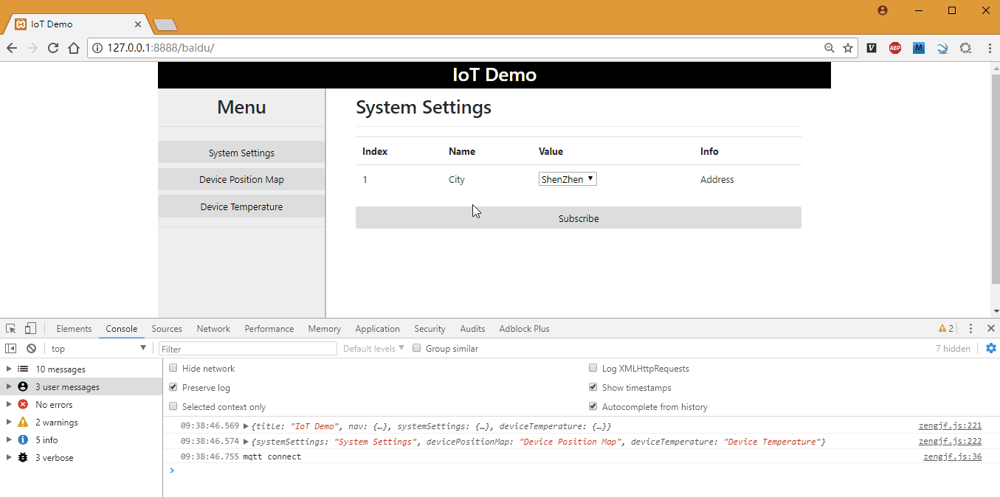

# Baidu Map

## Refers

* [百度地图](http://lbsyun.baidu.com/index.php)
* [百度地图 Demo](http://lbsyun.baidu.com/jsdemo.htm#a1_2)
* [百度天工](https://cloud.baidu.com/solution/iot/index.html)
* [orbitbot/chrome-extensions-examples](https://github.com/orbitbot/chrome-extensions-examples)

## Help

* 使用Python3运行`bin/python3/main.py`数据模拟器；
* 访问：http://zengjfos.github.io/BaiduMap
* 在`System Settings`页面订阅对应的地址；
* 在`Device Position Map`、`Device Temperature`查看相关信息；
